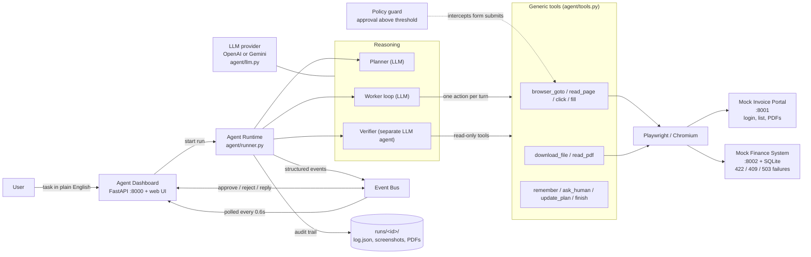
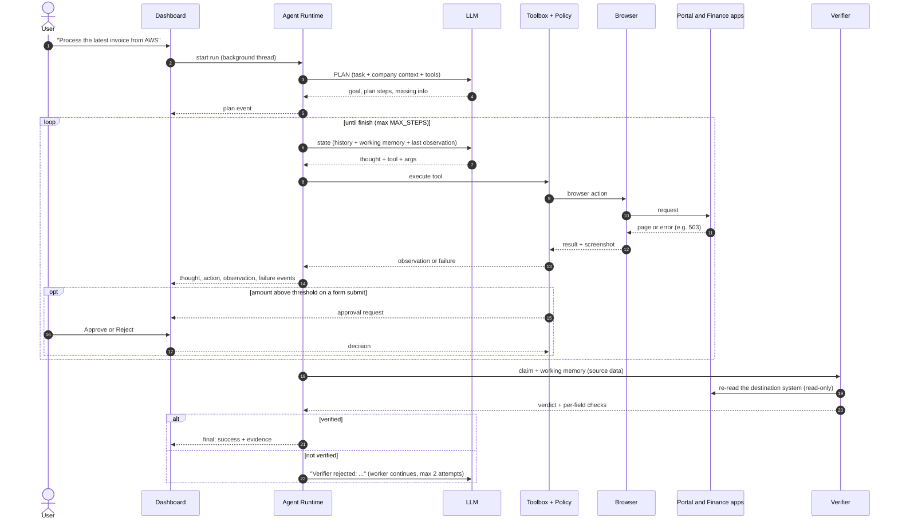
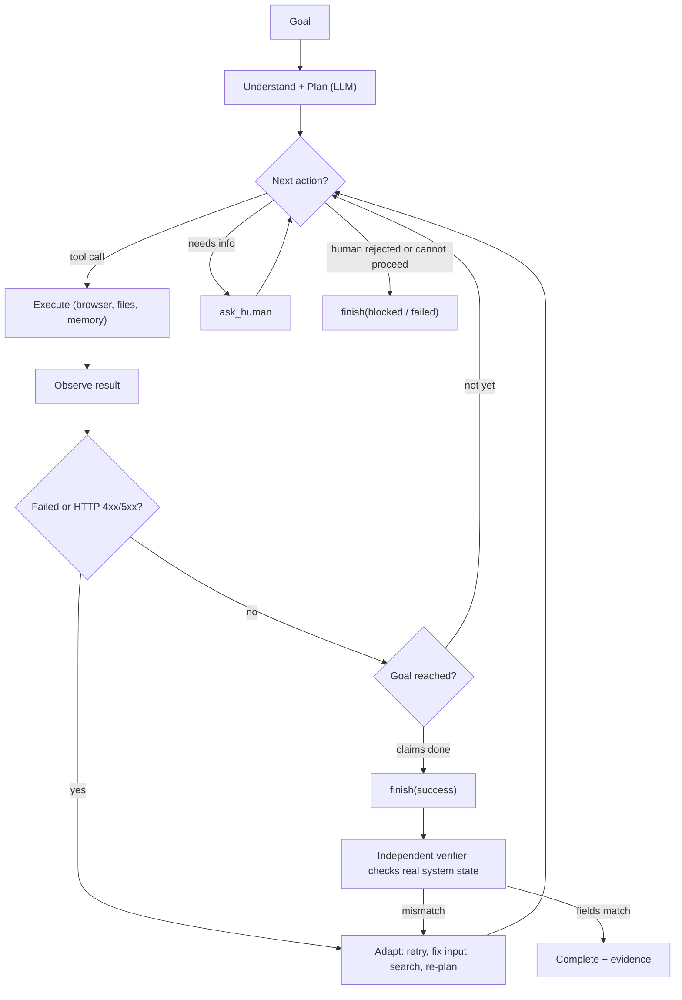

# Autonomous AI Task Worker

> An AI worker that takes a plain-English business task, such as **"Process the latest invoice from AWS"**, and completes it by **actually operating a real browser** against company systems. It plans, acts, observes, recovers from failures, asks a human when it should, and then has its own work **independently verified** before reporting back with evidence.

Built for the CentrAlign AI Engineering Intern assignment (*Autonomous AI Task Worker*).

---

## Table of contents
1. [What it does](#1-what-it-does)
2. [System architecture](#2-system-architecture)
3. [Working flow / pipeline](#3-working-flow--pipeline)
4. [Worked example: "Process the latest invoice from AWS"](#4-worked-example)
5. [Failure handling and recovery](#5-failure-handling-and-recovery)
6. [Verification and safety guardrails](#6-verification-and-safety-guardrails)
7. [Components and tools](#7-components-and-tools)
8. [Quick start](#8-quick-start)
9. [Demo scenarios](#9-demo-scenarios)
10. [Configuration](#10-configuration)
11. [Repository layout](#11-repository-layout)
12. [Design decisions](#12-design-decisions)
13. [Models, services and components used](#13-models-services-and-components-used)
14. [Assumptions](#14-assumptions)
15. [Known limitations](#15-known-limitations)
16. [What I would build next](#16-what-i-would-build-next)

---

## 1. What it does

A user types one instruction. The worker is **not** told the steps. It has to work them out.

```
"Process the latest invoice from AWS."
        |
        v
  find the invoice -> read the PDF -> enter it in the finance system -> confirm it was really saved -> report
```

| Capability | How it shows up in this prototype |
|---|---|
| Understand the goal | An LLM planner turns the request into a goal and a plan, and flags missing information |
| Plan | The plan is generated per task (not hard-coded) and can be revised mid-run |
| Select tools | The agent chooses from generic browser, file and memory tools each turn |
| Execute | Real Chromium (Playwright) logs in, downloads PDFs, fills and submits forms |
| Observe and adapt | Every action's result, including HTTP 4xx/5xx pages, is fed back to the LLM |
| Recover | Retries temporary errors, fixes bad input, searches instead of duplicating |
| Remember | Working memory holds facts found during execution (vendor, amount, due date...) |
| Ask a human | Clarifying questions and runtime-enforced approval for large amounts |
| Verify | A separate, read-only verifier agent re-checks the real system state |
| Evidence | Live timeline, screenshots, field-by-field verification table, saved run log |

---

## 2. System architecture



**Three layers, each replaceable on its own**

| Layer | Responsibility | Knows about invoices? |
|---|---|---|
| **Reasoning** (`runner.py`, `prompts.py`, `llm.py`) | Decide the next action, adapt to results, judge completion | No: company knowledge is injected as data |
| **Tools** (`tools.py`) | Do things on the computer: browser, files, memory, human | No: fully generic |
| **Environment** (`portal/`, `finance/`) | The simulated company applications | Yes: this is the "company" |

Because only the environment and `agent/company_context.md` are invoice-specific, a different workflow means editing that context file and swapping the mock apps, not rewriting the loop.

---

## 3. Working flow / pipeline

### 3.1 End-to-end sequence



### 3.2 The core loop



This is the `Goal -> Understand -> Plan -> Execute -> Observe -> Adapt -> Verify -> Complete` loop from the brief. The key difference from a "plan once, execute everything" script is that **every turn re-reads the latest state**, so the next action always depends on what actually happened.

### 3.3 Pipeline stages

| # | Stage | What happens | Where |
|---|---|---|---|
| 1 | **Intake** | The task arrives from the dashboard and a run id and event bus are created | `dashboard/server.py` |
| 2 | **Understand and plan** | The planner LLM returns `{goal, plan[], missing_info[]}` using the company context and tool list | `runner.py`, `prompts.py` |
| 3 | **Decide** | The worker LLM returns exactly one JSON action: `{thought, tool, args}` | `llm.py` |
| 4 | **Policy check** | When a form's submit button is clicked, its amount/total fields are inspected; above the threshold the run pauses for a human | `tools.py` (`Policy`) |
| 5 | **Execute** | Playwright performs the action; a screenshot is captured | `tools.py` |
| 6 | **Observe** | Page URL, title, text and **HTTP status** return to the LLM; 4xx/5xx raise an `http_error` event | `tools.py`, `runner.py` |
| 7 | **Remember** | Key facts are stored via `remember`, and re-sent every turn | `runner.py` |
| 8 | **Adapt** | The LLM decides: retry, correct, search, re-plan, ask a human, or stop | LLM + loop |
| 9 | **Verify** | A fresh read-only agent checks the destination system against the source data | `runner.py` (`verify`) |
| 10 | **Report** | Final status, summary, evidence and memory are emitted and the full log is saved | `runner.py`, `runs/<id>/log.json` |

---

## 4. Worked example

Task: **"Process the latest invoice from AWS."** *(Illustrative. The exact steps are chosen by the LLM at run time.)*

| Step | Agent action | Observation | Why |
|---|---|---|---|
| Plan | LLM-generated plan | goal and steps | Understand the outcome |
| 1 | `browser_goto` portal `/login` | login form | Needs access to invoices |
| 2-4 | `browser_fill` x2, `browser_click` "Sign in" | invoice list | Credentials come from company context |
| 5 | `browser_read_page` | 12 invoices, unsorted; AWS-1021, 1022, 1023 | Must choose the latest by **date**, not list position |
| 6 | `download_file` AWS-1023 PDF | saved to `runs/<id>/downloads/` | Source of truth |
| 7 | `read_pdf` | Total INR 1,24,500, due 20/10/2026 | Extract the fields |
| 8 | `remember` vendor, invoice number, amount, due date | memory updated | Survives context trimming |
| 9 | `browser_goto` finance `/invoices/new`, fill form, click Save | **HTTP 422**: amount must be plain digits | Observed failure |
| 10 | Adapt: re-enter amount as `124500`, submit again | **HTTP 503**: service temporarily unavailable | Observed failure |
| 11 | Adapt: retry the submit | redirected to the saved invoice page | Recovered |
| 12 | `finish(success, evidence)` | triggers verification | Never trust "clicked Save" |
| Verify | Verifier opens finance search for `AWS-1023` | vendor, amount and due date all match the PDF values | Independent confirmation |
| Done | Final result card + evidence | verified | |

---

## 5. Failure handling and recovery

The finance app injects realistic failures so that recovery is demonstrated, not claimed.

| Failure | How it is detected | Expected agent behaviour |
|---|---|---|
| **422** invalid amount or date format | `http_error` event + error text in the observation | Read the message, reformat the value, resubmit |
| **503** transient outage (first submit of every new invoice) | HTTP status in the observation | Retry (re-open the form if needed) |
| **409** duplicate invoice | HTTP 409 + "already exists" text | Do **not** duplicate: search the existing record, compare with the PDF, report |
| Selector or element not found | Playwright timeout turned into a `ToolError` | Call `browser_read_page` to learn real selectors, then try again |
| Wrong or ambiguous request | Planner `missing_info` or the agent's own judgement | `ask_human` for clarification |
| Human rejects an approval | `Blocked` error returned as the observation | Stop and finish with status `blocked` |
| Verifier disagrees | Verdict `verified: false` + failing checks | Worker is sent back to fix it (up to 2 verification attempts) |

**Loop protection:** a hard cap on total steps (`MAX_STEPS`), an abort after 6 consecutive failing actions, and truncated older observations to keep context small.

---

## 6. Verification and safety guardrails

**Independent verification.** When the worker calls `finish(success)`, the runtime does not accept it. It starts a **separate verifier agent** that:
- gets its own fresh browser page,
- is **read-only** (POST form submits and downloads are blocked),
- receives the task, the worker's claim, the worker's working memory (used as the source data) and the company context,
- must open the destination system itself and return `{verified, checks[{field, expected, actual, match}], summary}`.

`verified = true` only if the record exists **and every field matches**. If the verifier cannot prove it, the run is reported as failed or "not independently verified". It is never silently reported as success.

**Runtime-enforced approval.** The approval policy lives in code, not in the prompt, so the LLM cannot talk its way around it. Whenever the agent clicks a form's submit button, the runtime reads the form's `amount`/`total` fields. If the value is above `APPROVAL_THRESHOLD`, the browser action is held and the dashboard shows **Approve / Reject**. A rejection raises `Blocked`, and the agent is told to stop.

**Safe environment.** Everything is a local mock. No real credentials, no third-party systems.

---

## 7. Components and tools

### Generic tools exposed to the LLM
| Tool | Purpose |
|---|---|
| `browser_goto(url)` | Navigate |
| `browser_read_page()` | Return URL, title, visible text, links, inputs, buttons |
| `browser_click(selector)` | Click (CSS or Playwright selector, e.g. `text=Sign in`) |
| `browser_fill(selector, value)` | Type into an input |
| `download_file(url, filename)` | Download using the logged-in browser session |
| `read_pdf(path)` | Extract text from a downloaded PDF |
| `remember(key, value)` | Working memory |
| `ask_human(question)` | Clarification, blocks until answered |
| `update_plan(plan, reason)` | Re-plan when reality differs |
| `finish(status, summary, evidence)` | End the task (`success` / `failed` / `blocked`) |

There is deliberately **no** `submit_invoice()`. The agent composes generic actions to get the job done.

### Dashboard
Live activity timeline (think / act / observe / adapt), the plan (with revisions), working memory, screenshots, approval box, verification table and final result card.

---

## 8. Quick start

**Prerequisites:** Python 3.10+, an OpenAI **or** Gemini API key.

```bash
# 1) environment
python -m venv .venv
source .venv/bin/activate            # Windows: .venv\Scripts\activate
pip install -r requirements.txt
playwright install chromium

# 2) configure
cp .env.example .env                 # Windows: copy .env.example .env
#    then edit .env and set OPENAI_API_KEY (or GEMINI_API_KEY)

# 3) optional: verify the mock environment works (no API key needed)
python scripts/smoke_test.py

# 4) run everything (portal :8001, finance :8002, dashboard :8000)
python run.py
```

Open **http://127.0.0.1:8000**, pick an example chip, press **Run task**. Set `HEADLESS=0` in `.env` to watch the browser work.

---

## 9. Demo scenarios

Each scenario exercises a different capability. Press **Reset environment** between runs.

| Task | Capability shown |
|---|---|
| `Process the latest invoice from AWS.` | Picks the latest by date (list is unsorted), reads the PDF, recovers from **422** and **503**, then verification |
| `Process the latest invoice from Google Cloud.` | **Duplicate (409)**: the invoice already exists, so the agent verifies the existing record instead of creating a second one |
| `Process the latest invoice from Microsoft.` | **Human approval**: amount is INR 85,00,000, above the threshold. Approve to continue, Reject to see it stop as `blocked` |
| `Process the latest invoice.` | **Clarification**: no vendor given, so the agent asks the user |

Every run is saved to `runs/<run-id>/` (`log.json` event log, screenshots, downloaded PDFs) as an audit trail.

---

## 10. Configuration

All settings live in `.env` (see `.env.example`).

| Variable | Default | Meaning |
|---|---|---|
| `LLM_PROVIDER` | auto-detected | `openai` or `gemini` (inferred from whichever key is set) |
| `OPENAI_API_KEY` / `OPENAI_MODEL` | - / `gpt-4o-mini` | OpenAI settings |
| `GEMINI_API_KEY` / `GEMINI_MODEL` | - / `gemini-2.5-flash` | Gemini settings |
| `HEADLESS` | `1` | `0` shows the browser window |
| `MAX_STEPS` | `40` | Step budget for the worker loop |
| `APPROVAL_THRESHOLD` | `1000000` | INR amount above which a form submit needs human approval |
| `FLAKY_FINANCE` | `1` | `1` makes the finance app fail the first submit of each new invoice (503) |
| `DASHBOARD_PORT` / `PORTAL_PORT` / `FINANCE_PORT` | `8000` / `8001` / `8002` | Ports |
| `PORTAL_USER` / `PORTAL_PASS` | `ap.bot` / `portal123` | Mock portal credentials |

---

## 11. Repository layout

```
.
├── run.py                    # one command: starts portal, finance, dashboard
├── config.py                 # env-driven configuration
├── utils.py                  # INR formatting, amount parsing, shared HTML layout
├── requirements.txt
├── .env.example
├── agent/
│   ├── runner.py             # planner -> worker loop -> verifier
│   ├── tools.py              # generic browser/file tools + Policy guard
│   ├── llm.py                # provider-agnostic JSON chat (OpenAI / Gemini)
│   ├── prompts.py            # worker / planner / verifier prompts
│   ├── events.py             # event bus + human-in-the-loop channel
│   └── company_context.md    # company knowledge as data (systems, procedures, policy)
├── portal/                   # mock vendor invoice portal (login, list, PDFs)
├── finance/                  # mock finance system (SQLite, injected failures)
├── dashboard/                # FastAPI backend + live web UI
└── scripts/
    └── smoke_test.py         # environment checks, no API key required
```

---

## 12. Design decisions

1. **Generic tools + company context as data.** The loop knows nothing about invoices. Workflow knowledge lives in `company_context.md`, so supporting a new task means changing data, not code (the *Generalization* criterion).
2. **Observation-driven loop, not a fixed script.** One action per turn, with the latest result and memory fed back each time. Plans are guidance and can be revised via `update_plan`.
3. **Independent, read-only verifier.** Verification is a separate agent with a clean browser page and restricted tools, so a worker that wrongly believes it succeeded cannot grade its own homework.
4. **Policy enforced in the runtime.** Safety-critical rules (approval above a threshold) are code, not prompt text, so they hold even if the model misbehaves.
5. **Page-level errors count as observations.** A 503 page is a normal browser response, not an exception. Surfacing HTTP status to both the LLM and the dashboard makes recovery visible and decision-driven.
6. **JSON-action protocol instead of native function-calling.** The same loop runs identically on OpenAI and Gemini with one small adapter.
7. **Bounded context.** Older observations are truncated; durable facts live in explicit working memory.
8. **Local mock environment.** Reproducible demos, injectable failures, and no real credentials or third-party systems.

---

## 13. Models, services and components used

| Area | Choice |
|---|---|
| LLM | OpenAI (default `gpt-4o-mini`) **or** Google Gemini (default `gemini-2.5-flash`), via the `openai` and `google-genai` SDKs |
| Browser automation | Playwright (Chromium) |
| Backend / web | FastAPI, Uvicorn, vanilla HTML/JS dashboard |
| Data | SQLite (mock finance DB) |
| Documents | `reportlab` (generate invoice PDFs), `pypdf` (read them) |
| Config | `python-dotenv` |

No pre-built agent framework is used. The loop, planner, policy and verifier are custom. No real company credentials or external systems are involved.

---

## 14. Assumptions

- "Latest" means the most recent **invoice date**, not the list position.
- The invoice PDF is the source of truth for amount and due date. Currency is INR and the amount is the GST-inclusive total.
- Mock portal credentials are provided to the agent through company context, standing in for a secrets vault.
- The approval threshold is INR 10,00,000 and is configurable.
- One task runs at a time.

---

## 15. Known limitations

- **DOM/text-based browsing.** No vision, so canvas-heavy or highly dynamic UIs would need screenshot-based computer use.
- **Text PDFs only.** No OCR for scanned invoices.
- **Single task, in-memory state.** No queue, no persistence across restarts, no dashboard authentication.
- **The verifier is an LLM.** It is a strong independent check, not a formal guarantee.
- **Verifier's source data comes from the worker's memory.** It independently re-reads the *destination* system, but compares it with what the worker remembered. If the worker misread the PDF and remembered the wrong value, the check would still pass. The verifier has no PDF tool yet.
- **The approval guard covers submit-button clicks only.** Other ways of submitting (for example pressing Enter in a field) are not intercepted.
- **Model quality matters.** Smaller models can stall on long tasks. If a run struggles, use `gpt-4o` or `gemini-2.5-pro`.
- **Limited failure catalogue.** Only 422, 409 and 503 are injected. Real systems fail in more ways.

---

## 16. What I would build next

1. **Independent source check:** give the read-only verifier a PDF-reading tool so it re-derives expected values from the invoice itself instead of trusting the worker's memory.
2. **Persistent company memory** and learning from past runs and human feedback.
3. **Vision fallback** (screenshot-based computer use) for when selectors fail.
4. **Task queue and scheduler** for background execution, retries and concurrency.
5. **Secrets vault and per-action permission scopes** instead of credentials in context.
6. **Evaluation harness**: a task x failure-mode matrix with success, step-count and recovery metrics.
7. **OCR** for scanned invoices.
8. **API connectors** (email, ERP) so the agent prefers APIs over UI automation when one exists.